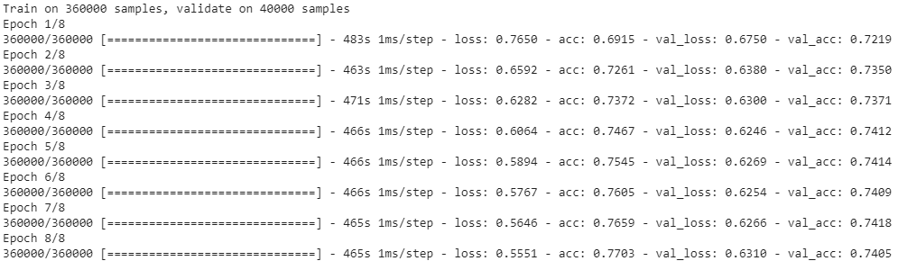

# Hierarchical Attentional Hybrid Neural Networks for Document Classification

J. Abreu , L. Fred, D. Macêdo, C. Zanchettin, "[**Hierarchical Attentional Hybrid Neural Networks for Document Classification**](https://arxiv.org/abs/1901.06610)".

## Performance on Yelp Dataset multi-class

## Run this code on Google Colab with Free GPU

## Datasets:
| Dataset                | Classes | Documents | download |
|------------------------|:---------:|:-------:|:--------:|
| Yelp Review Polarity   |    5    |    1569264   |[link](https://www.kaggle.com/luisfredgs/hahnn-for-document-classification)|
| IMDb Movie Review      |    2    |    50000       | [link](https://www.kaggle.com/luisfredgs/hahnn-for-document-classification)|

Pre-trained FastText word embeddings can be downloaded in [https://www.kaggle.com/luisfredgs/wiki-news-300d-1m-subword](https://www.kaggle.com/luisfredgs/wiki-news-300d-1m-subword)

To run this notebook on Google Colab you don't need download these files. Type your kaggle username and API key during cell execution and wait. Will done.

## Requirements

* Python 3
* tensorflow 1.10
* Keras 2.x
* spacy 2.0
* gensim
* tqdm
* matplotlib

A GPU with CUDA support is required to run this code. On Google Colab, Select "**Runtime**," "**Change runtime type**" to Python 3. Ensure "**Hardware accelerator**" is set to GPU (the default is CPU).

